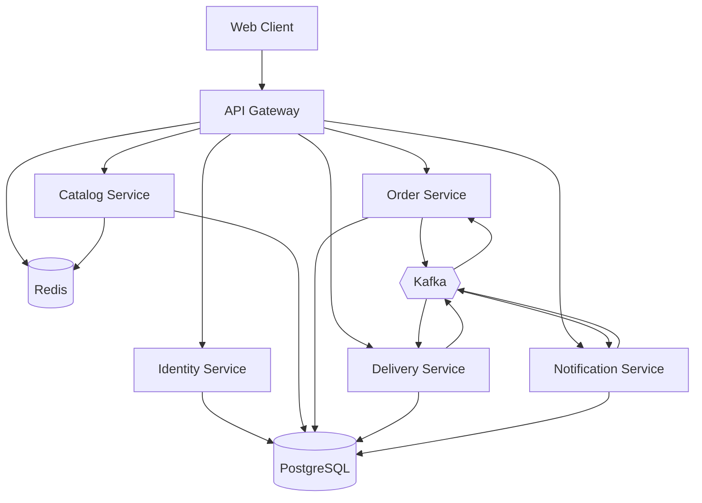
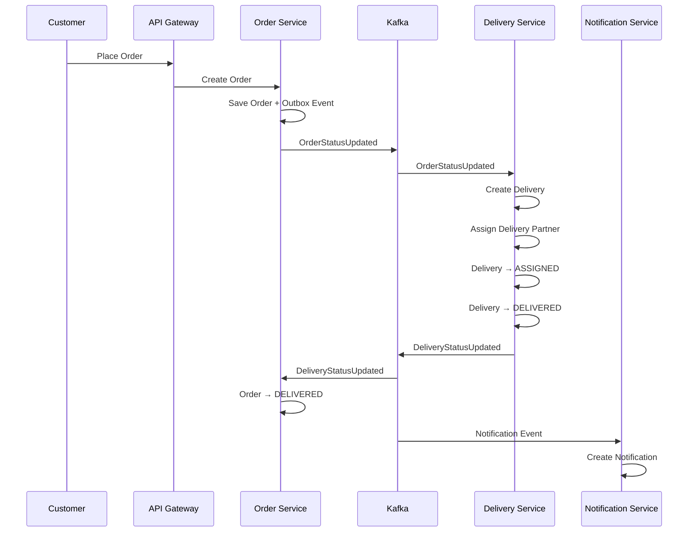
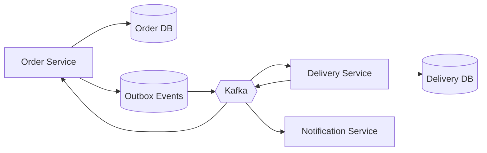

# 🍔 Food Delivery Platform

A microservices-based Food Delivery Platform built to demonstrate practical backend engineering and distributed-systems concepts.

The project focuses on authentication, authorization, API Gateway patterns, asynchronous event-driven communication, caching, idempotency, distributed locking, and resilient service-to-service communication.

---

## 🚀 Live Services

| Service | Status | API |
|---|---|---|
| Identity Service | ✅ Live | https://delivery-platform-xo8w.onrender.com/docs |
| Catalog Service | ✅ Live | https://food-catalog-service.onrender.com/docs |
| Order Service | ✅ Live | https://delivery-platform-oezs.onrender.com/docs |
| Delivery Service | ✅ Live | https://delivery-service-nzxj.onrender.com/docs |
| Notification Service | ✅ Live | https://delivery-platform-dzuv.onrender.com/docs |

---

## 🏗️ Architecture



---

## 🔄 Order & Delivery Flow

The order lifecycle uses asynchronous Kafka events between services.



---

## 📨 Event-Driven Architecture

Kafka is used for asynchronous communication between services.



### Transactional Outbox

Business changes and events are persisted in the same database transaction.

```text
Database Transaction
        │
        ├── Update business data
        │
        └── Create Outbox Event
                 │
                 ▼
               COMMIT
                 │
                 ▼
          Outbox Publisher
                 │
                 ▼
               Kafka
```

This avoids the common failure scenario where the database transaction succeeds but publishing the Kafka event fails.

---

## 🧱 Repository Structure

```text
food-delivery-platform/
│
├── frontend/
│   └── React + TypeScript
│
├── gateway/
│   └── API Gateway
│
├── services/
│   │
│   ├── identity-service/
│   │   └── Authentication & Authorization
│   │
│   ├── catalog-service/
│   │   └── Restaurants, Categories & Menu Items
│   │
│   ├── order-service/
│   │   └── Orders, Order Items & Outbox
│   │
│   ├── delivery-service/
│   │   └── Deliveries, Partners & Assignment
│   │
│   └── notification-service/
│       └── User Notifications
│
├── infrastructure/
│   ├── docker/
│   ├── nginx/
│   ├── monitoring/
│   └── k8s/
│
├── docs/
│
├── docker-compose.yml
│
└── README.md
```

---

## 🛠️ Technology Stack

### Backend

- Python
- FastAPI
- SQLAlchemy 2.0
- Alembic
- Pydantic
- JWT
- REST APIs

### Database

- PostgreSQL
- Supabase

### Messaging

- Apache Kafka
- Aiven Kafka
- aiokafka

### Caching & Distributed Coordination

- Redis
- Redis caching
- Redis rate limiting
- Redis distributed locking

### Frontend

- React
- TypeScript
- Vite
- Mantine UI
- Zustand
- React Query

### Infrastructure

- Docker
- Docker Compose
- Render
- GitHub

---

## 🔐 Authentication & Authorization

The Identity Service handles:

- User registration
- Login
- Password hashing
- JWT access tokens
- Refresh tokens
- Role-based authorization

Supported roles:

```text
CUSTOMER
RESTAURANT_OWNER
DELIVERY_PARTNER
ADMIN
```

JWT contains user identity and role information used for authorization.

---

## ⚡ Redis

Redis is used for multiple backend concepts.

### Caching

Frequently accessed Catalog data is cached.

```text
Client
  │
  ▼
Gateway
  │
  ▼
Catalog Service
  │
  ▼
Redis Cache
  │
  ├── HIT  ──→ Return Cached Data
  │
  └── MISS ─→ PostgreSQL
                │
                ▼
             Redis
                │
                ▼
             Response
```

Cache invalidation is performed when relevant restaurant or menu data changes.

### Rate Limiting

The API Gateway uses Redis to maintain request counters.

```text
Request
   │
   ▼
Gateway
   │
   ▼
Redis Counter
   │
   ├── Limit exceeded ──→ 429
   │
   └── Allowed ─────────→ Downstream Service
```

### Distributed Locking

Delivery assignment uses a Redis lock to prevent concurrent assignment operations for the same delivery.

```text
             ┌── Request A ──→ Acquire Lock ──→ Assignment
             │
Delivery ────┤
             │
             └── Request B ──→ Lock Exists ──→ 409 Conflict
```

---

## 📨 Kafka

Kafka is used for asynchronous communication between services.

Example:

```text
Order Service
     │
     │ OrderStatusUpdated
     ▼
   Kafka
     │
     ▼
Delivery Service
     │
     │ DeliveryStatusUpdated
     ▼
   Kafka
     │
     ▼
Order Service
     │
     ▼
Order = DELIVERED
```

Kafka consumer groups allow services to independently consume events.

---

## 🔁 Reliability Patterns

### Idempotency

Order creation uses idempotency keys to prevent duplicate operations when requests are retried.

```text
Request
   │
   ▼
Idempotency Key
   │
   ├── Already processed ──→ Duplicate
   │
   └── New ────────────────→ Process Request
```

### Retry & Exponential Backoff

Transient failures are retried using exponential backoff.

```text
Attempt 1
   │
 Failure
   │
 Wait
   │
Attempt 2
   │
 Failure
   │
 Longer Wait
   │
Attempt 3
```

### Dead Letter Queue

Messages that repeatedly fail processing are moved to a DLQ.

```text
Kafka
  │
  ▼
Consumer
  │
  ▼
Processing Failed
  │
  ▼
Retry × 3
  │
  ▼
Still Failed
  │
  ▼
DLQ
```

### Correlation IDs

Request IDs are propagated across services and Kafka events to make distributed requests traceable through logs.

---

## 🏪 Microservices

### Identity Service

Responsible for:

- Registration
- Login
- JWT authentication
- Refresh tokens
- Password hashing
- User roles

### Catalog Service

Responsible for:

- Restaurants
- Categories
- Menu items
- Menu item search
- Availability
- Restaurant ownership
- Authorization
- Redis caching

### Order Service

Responsible for:

- Order creation
- Order items
- Order status
- Idempotency
- Outbox events
- Kafka integration

Order lifecycle:

```text
PENDING
   │
   ▼
CONFIRMED
   │
   ▼
PREPARING
   │
   ▼
READY
   │
   ▼
DELIVERED
```

### Delivery Service

Responsible for:

- Delivery creation
- Delivery partners
- Partner availability
- Delivery assignment
- Redis distributed locking
- Delivery status
- Outbox events
- Kafka consumers

Delivery lifecycle:

```text
PENDING
   │
   ▼
ASSIGNED
   │
   ▼
PICKED_UP
   │
   ▼
DELIVERED
```

### Notification Service

Responsible for:

- Creating notifications
- Retrieving user notifications
- Marking notifications as read
- Marking all notifications as read
- Consuming notification-related Kafka events

---

## 🗃️ Database Migrations

Create migration:

```bash
alembic revision --autogenerate -m "migration message"
```

Apply migrations:

```bash
alembic upgrade head
```

Rollback:

```bash
alembic downgrade -1
```

---

## 🐳 Running Locally

Clone the repository:

```bash
git clone https://github.com/<username>/food-delivery-platform.git

cd food-delivery-platform
```

Start the platform:

```bash
docker compose up --build
```

---

## 📋 Features

- [x] Microservices Architecture
- [x] API Gateway
- [x] JWT Authentication
- [x] Role-Based Authorization
- [x] PostgreSQL
- [x] SQLAlchemy
- [x] Alembic
- [x] Repository Pattern
- [x] Service Layer
- [x] Dependency Injection
- [x] Redis Caching
- [x] Redis Cache Invalidation
- [x] Redis Rate Limiting
- [x] Redis Distributed Locking
- [x] Kafka
- [x] Kafka Consumer Groups
- [x] Event-Driven Architecture
- [x] Transactional Outbox
- [x] Idempotency
- [x] Retry & Exponential Backoff
- [x] Dead Letter Queue
- [x] Correlation IDs
- [x] Structured Logging
- [x] Health Checks
- [x] Readiness Checks
- [x] Docker
- [x] Cloud Deployment
- [x] Notifications
- [ ] CI/CD Pipeline
- [ ] Kubernetes Deployment

---

## 🎯 Learning Objectives

This project demonstrates practical experience with:

- Microservices architecture
- REST APIs
- Authentication & authorization
- Database design
- Repository and service patterns
- API Gateway architecture
- Redis caching
- Rate limiting
- Distributed locking
- Kafka event streaming
- Event-driven architecture
- Transactional Outbox
- Idempotency
- Retry strategies
- Dead Letter Queues
- Distributed request tracing
- Dockerized applications
- Cloud deployment

---

## 📌 Project Goal

The goal of this project is not to build a complete commercial food-delivery system.

It is a practical backend engineering project focused on understanding and demonstrating real-world backend and distributed-system concepts
